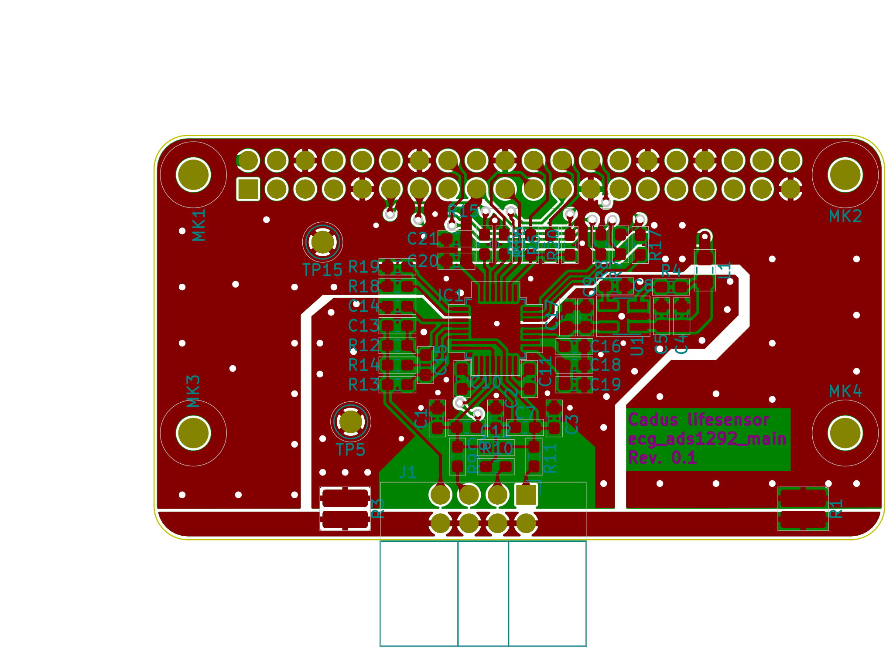

# lifesensor ecg_ads1292
The lifesensor ecg_ads1292 component provides a [ECG](https://en.wikipedia.org/wiki/Electrocardiography) frontent based on Texas Instruments [ADS1292](http://www.ti.com/lit/ds/symlink/ads1292.pdf).

WARNING: THIS COMPONENT DOES NOT PROVIDE ANY PROTECTION AGAINST ELECTRICAL SHOCKS! ALWAYS USE APPROPRIATE MEDICAL APPROVED POWER SUPPLIES! USE AT YOUR OWN RISK!

## Objectives
This component is developed to quickly provide a first ECG sensor that can deliver reference data for comparison with other self-developed and possibly cheaper ECG frontends. It will also provide the possibility to test other (software) components like the pulse detection and the lifesensors [sensor bus](../system/lifesensor_system.svg) with real data.
<!-- TODO: link to sensor bus description -->

To minimize the development effort integrated circuits that include all needed analog circuitry are chosen. The ADS1292 is chosen because in a search it was the cheapest one that can provide a three channel ECG found.

Due to the prototype characteristics the development of the ecg_ads1292 compontent is not focusing on low prizes, availability or repairability.

## Subcomponents

This component consists of one PCB [ecg_ads1292_main](pcbs/ecg_ads1292_main) and a [driver](firmware).

For a description of the development of the PCB see [pcbs/ecg_ads1292_main/docs/README.md](pcbs/ecg_ads1292_main/docs/README.md)

For a description of the driver see [firmware/README.md](firmware/README.md)

#### Board view
This is a view of the last released version of the board:

