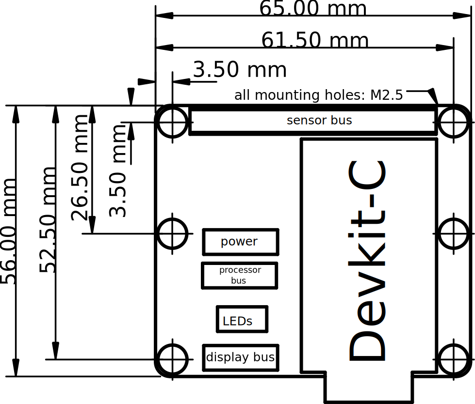
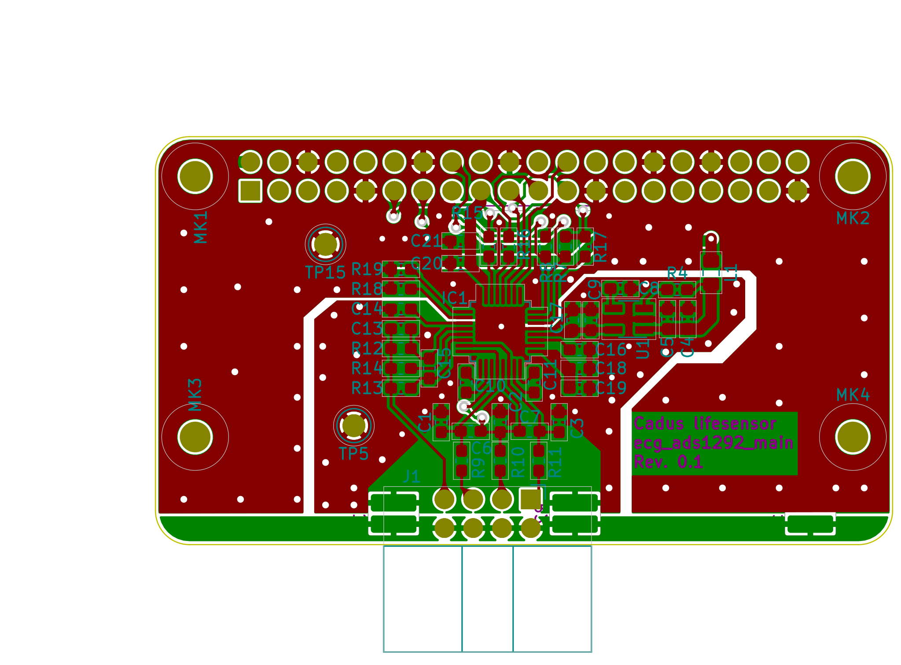

# lifesensor ecg_ads1292
This document describes the [ECG](https://en.wikipedia.org/wiki/Electrocardiography) component based on Texas Instruments integrated ECG front end [ADS1292](http://www.ti.com/lit/ds/symlink/ads1292.pdf).

**WARNING: THIS CIRCUIT DOES NOT PROVIDE ANY PROTECTION AGAINST ELECTRICAL SHOCKS! ALWAYS USE APPROPRIATE MEDICAL APPROVED POWER SUPPLIES! USE AT YOUR OWN RISK!**

---

## Objectives
This component is developed to quickly provide a first ECG sensor that can deliver reference data for comparison with other self-developed and possibly cheaper ECG frontends. It will also provide the possibility to test other (software) components like the pulse detection and the lifesensors [sensor bus]() with real data.
<!-- TODO: link to sensor bus description -->

To minimize the development effort integrated circuits that include all needed analog circuitry are chosen. The ADS1292 is chosen because in a search it was the cheapest one that can provide a three channel ECG found.

Due to the prototype characteristics the development of the ecg_ads1292 compontent is not focusing on low prizes, availability or repairability.

## Subcomponents

This component consists of one PCB [ecg_ads1292_main](../pcbs/ecg_ads1292_main) and a [driver](../firmware).

For a description of the development of the PCB see [../pcbs/ecg_ads1292_main/docs/README.md](../pcbs/ecg_ads1292_main/docs/README.md)

For a description of the driver see [../firmware/README.md](../firmware/README.md)

<!-- ## Usage -->
<!-- TODO: links and explanations  -->

## Development

### Schematics
The schematics can be found in 

The main sources for the circuit design are
- the ADS1292 data sheet: http://www.ti.com/lit/ds/symlink/ads1292.pdf
- TI Bio-Signal Monitor Reference Design: https://www.ti.com/tool/TIDM-BIOSIGNMONITOR
- the ADS1x9xECG-FE Demonstration Kit User's Guide: https://www.ti.com/lit/ug/slau384a/slau384a.pdf

The development of the circuits is straight forward as the ADS1292 only needs a few passive components and an optional LDO for the analog frontend, and a few others for connecting it to the [sensor bus](../../system/interconnect.md). Most components can be directly derived from the data sheet or the other links given above.

Nevertheless the following  will describe the circuits and components that differ from the references.

#### Analog input section
The input filter of the analog inputs IN1 to IN3 of the ADS1292R was derived from the Texas Instruments [demo board](http://www.ti.com/tool/TIDM-BIOSIGNMONITOR).
The input resistors R9 to R22 values have been decreased from 51kΩ to 22kΩ to compensate for the external defibrillator input protection.
Also the circuit has been changed so that each of three leads of the Einthoven triangle can be directly conected to one of the three input channels.
(Note however that only two leads can be measured directly, as the ADS1292 only comprises two ADCs. The third lead can be calculated from the other two).
The reason is, that if one electrode is torn off, the software can always switch to an input that is connected to the remaining two electrodes.
This way at least one valid lead can be measured in this case.

#### Right leg driver (*1*)
The wiring of the right-leg driver has also been adapted from th demo board. 
The Right-Leg-Driver is an OPV integrated in the ADS1292R, whose output (pin 30) is connected to an electrode on the patient via a resistor that will be included with the defibrillator protection. 
Therefore on this board the limiting output resistor was omitted.
To make the RLD compliant to the current limits (body floating, single fault codition -> max. 50µA DC according to wikipedia) an 100kΩ resistor R13 is inserted at the OPA output. On the demo board a 0Ω bridge is used at this point.
The idea for the circuit modification was taken from the Texas Instruments application report 'Improving Common-Mode Rejection Using the Right-Leg DriveAmplifier' ( www.ti.com/lit/an/sbaa188/sbaa188.pdf ). So if RLDOUT should be fully driven in case of an error, the output current is still limited by R13.
Due to the characteristics of the OPV, the potential between the resistors, i.e. at the connectors RLD output, is the same in both cases.
Since it is determined solely by the resistor R12 connected to the inverting input RLDINV.
In the real circuit, this means that the output of the OPV needs higher output voltage swing and has higher distortions.
Since the output current of the OPV is usually 1μA according to the Application Report, R13 leads to an additional voltage swing of 0.1V in the present circuit.
The disadvantages mentioned above should therefore be negligible.
As a result, the output impedance of the right-leg driver can be lowered.
It can be assumed that this will result in a higher cut-off frequency and a better response of the right-leg driver.

#### Analog power supply
To keep the analog power supply as quiet as possibly during prototyping and testing an additional LDO is inserted.
This can be ommitted after testing.

#### Analog frontend connection
The analog frontend will be connected to an external defibrillator protection circtuit.
To keep the ground connection between the two PCBs flexible the GND pins of Connector J1 have their own GNDPWR net, which can be connected to the GND net via several solder bridges at different points.

#### Sensor bus connection

A few notes about the sensor bus connection:
- no external Clock is required, therfore the CLKSEl pin is pulled high and the CLK pin is left unnconnected
- The GPIOs are not needed. The data sheet recommends to pull them down, which is down with two 6.8kΩ resistors.
- All digital output signals have a 100Ω series resistor to improve EMI. 
  TODO: evaluate signal quality in real environment.

The following list describes the nets of the sensor bus this component accesses.

**Power**

| Label           | Pin| Pi Header          |
|:----------------|:---|:-------------------|
| SENS_5V_ANA     | 2  | 5V power           |
| SENS_3V3_DIG    | 17 | 3V3 power          |

**Signals**

| Label           | Pin| Pi Header          |
|:----------------|:---|:-------------------|
| SENS_ECG_DRDY   | 11 | GPIO17             |
| SENS_START      | 13 | GPIO27             |
| SENS_RST_ECG_n  | 16 | GPIO23             |
| SENS_MOSI       | 19 | GPIO10 (MOSI)      |
| SENS_MISO       | 21 | GPIO9 (MISO)       |
| SENS_SCLK       | 23 | GPIO11 (SCLK)      |
| SENS_CS_ECG_n   | 24 | GPIO8 (CE0)        |

- **SENS_ECG_DRDY** Data ready. Is pulled down by the ADS1292 when a new sample has been taken. -> **ESP:** Interrupt on the falling edge, that triggers fetching the sample via SPI bus.
- **SENS_START** After configuring the continuos conversion mode the ADS129 starts sampling, when this signal is pulled HIGH. -> **ESP:** output push pull
- **SENS_RST_ECG_n** After system start the ADS1292 needs two reset pulses by driving this signal LOW. **ESP:** output push pull
- **SENS_MOSI** SPI bus
- **SENS_MISO** SPI bus
- **SENS_SCLK** SPI bus clock, maximum frequency is twice the ADS1292 base clock, so 1.024MHz when running on the internal 512kHz clock. **ESP:** (clock polarity: low, phase: second edge)
- **SENS_CS_ECG_n** SPI chip select for the ECG (no inter byte pulses, after transmitting data, this signal must not be driven HIGH agian to fast, see data sheet for SPI timing constraints)

### Layout

The constraints for the layout are
- 2 Layer
- best signal quality
- form factor (maximum) and mounting holes for RPi HAT:

---

The board is not intended to be etched by a maker space or hobbyist, therefore vias and small structures can be used.
For the layout the hints in the datasheet are followed.
It states that the GND plane could be split, if the star point is at the ADS1292, but in general this is not neccessary with correct component placement and routing.
In this case a split is done, to keep the analog GND plane small to avoid coupling as the environement is not yet known.

Here is a view of the layout:

(*1*) This section is based on a translation of a documentation for a project at Technische Universität Berlin

### Prototypes 1 and 2

Two prototypes have been produced July 2020.
As no LDO where ordered the analog supply voltage is directly using the 5V from the interconnect. This is done by shorting the appropriate pads for the LDO. (The ADS1292 allows the analog supply voltage to be 5V).

For the first tests a STM32 based NUCLEO-L476RG dev board was used.
Both power and digital signals where connected to that board.
The test program streams the data via UART to the included virtual serial port of the NUCLEO-L476RG which is connected to a PC.

To test the boards, the internal test signals of the ADS1292 are used.
With prototype 1 also a real ECG signal was successfully recorded.

#### Prototype 1
The tests show that the internal 2.4V reference voltage is not stable.
This leads to intermittent changes in the measured signal: at somw point they start to drift and sometimes saturate shortly just before recovering again.

After switching to the 4V reference these issues are gone. This is (only) possible because a 5V analog supply voltage is used.
This means that
**the 2.4V reference voltage of prototype 1 can not be used.**

While recording the real ECG signal the host PC (notebook) was detached from the mains adapter for safety reasons.
The result was visually ok. One channel had a little bit more noise which is due to the RLD input not beeing connected to one of the inputs of that channel. This can be improved at a later point.

#### Prototype 2
This device worked as expeceted.
But while testing the external analog input circuits, the signals saturated. The reason was, that the 2.4V internal reference was used, but the RLD pushes the potential to $V_{DDA} / 2 = 5V / 2 = 2.5V$, which is then outside  of the ADC range.
It should therefore be noted that, when using 5V as analog supply voltage, the internal reference voltage must be set to 4V or the RLD reference voltage must be supplied from an external voltage devider that provides a voltage below 2.4V (ideally 1.2V).

