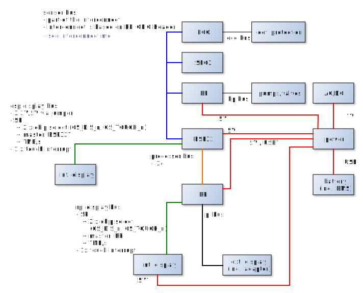

# Development of esp32_devkitc

## System interfaces of the esp32 component

The following figure shows the connections between the different components of the lifesensor:
 
The esp32 component is in the middle of the graph and
has four interfaces:

- The **power bus** towards the power component,
- the **sensor bus** towards the ecg, spo2, and bp components,
- the **display bus** towards a possible small internal display, and
- the **processor bus** towards an Raspberry Pi that may drive a bigger internal or external display

The following sections describe each interface in more detail.
### Power bus
The esp32 component is provided with a 5V from the power component.
The esp32 component then provides a digital and a analog 3.3V rail, as well as a analog 5V rail and distributes these rails to components on the sensor and display bus.

In order to be able to use simple power circuits both the output current 
of the provided rails is limited 
- to 200mA for the analog 5V rail,
- to 150mA for the analog 3.3V rail, and
- to 50mA for the digital 3.3V rail.

If this limit is exceeded, some of the components must directly use the 5V supply from the main power component and generate their own rails if needed. (See power component for limits of that rail.)

The DevKit-C uses a ESP32-Wroom which requires 500mA from a 3.3V rail.
The 3.3V power rail is provided by the DevKit-C itself with a AMS1117-3.3 LDO that can deliver up to 1A. This is sufficient to power the ESP32-Wroom and the 200mA for external components.

The maximum total input current of the 5V power rail then calculates to
$$
I_{5V, in, max} = \overbrace{500mA}^{ESP32-Wroom} + \overbrace{200mA}^{3.3V extern} + \overbrace{200mA}^{5V extern} = 900mA
$$

For the 5V input and analog rails a broad range of 4.5V to 5.5V is allowed.
For the 3.3V analog and digital output rails a closer range between 3.2V and 3.3V must be provided.

### Sensor bus
The sensor bus is part of the main interconnect, which is described in more detail in [/components/system/interconnect.md](../../system/interconnect.md).

It is based on the Raspberry Pi HAT connector and provides
- analog 5V power rail (provided by the esp32 component)
- analog 3.3V power rail (provided by the esp32 component)
- digital 3.3V power rail (provided by the esp32 component)
- SPI bus 
  - with three chip select lines for the three sensors (SENS_CS_ECG_n, SENS_CS_SPO2_n, SENS_CS_BPM_n)
  - esp32 component is master
  - might be shared with esp32 display SPI bus via jumper (excluding chip select signals)
- a reset signal for each sensor (SENS_RST_ECG_n, SENS_RST_SPO2_n, SENS_RST_BPM_n)
- one start signal for all sensors
- an interrupt line for each sensor (SENS_ECG_DRDY, SENS_SPO2_DRDY, SENS_BPM_DRDY)
- two GPIO lines that can be used for signals between the esp32 component and costum sensors (SENS_IO0, SENS_IO1)
- an I2C bus (SENS_SDA, SENS_SCL)
  - that might be used by the processor bus (jumper/solder bridge on ESP32 component)

### Internal display bus
The Internal display bus provides the possibility to connect a display with low resolution directly to the stm32.
For this the following signals/rails are provided
- 5V or 3.3V power rail (switchable per jumper/solder bridge on ESP32 component)
- SPI bus with 
  - two chip selects for display and touch sensor (INTDISP_CS_DISP_n, INTDISP_CS_TOUCH_n)
  - ESP32 is master
  - might be shared with sensor SPI bus via jumper (excluding chip select signals)
  - an interrupt signal for the touch sensor (INTDISP_ISR_TOUCH)

### Processor bus
The processor bus is a single I2C bus with the ESP32 module as master and the
RPi as slave. The I2C bus is
- has signals PROC_SDA and PROC_SCL
- might use the interconnect (jumper/solder bridge on ESP32 component)

## Other connections of the esp32 component
Besides the four interfaces to other system components, the esp32 component needs other connectors, which are described in the following sections.

### JTAG Header
A 20 pin ARM JTAG header is connected according to https://raw.githubusercontent.com/gojimmypi/ESP32/master/images/myESP32%20DevKitC%20pinout.png

| DevKitC Pin | JTAG signal  | header pin |
|---|---|---|
| 3V3  | VTref | 1 |
| EN | nTRST | 3 |
| IO12 | TDI | 5 |
| IO14 | TMS | 7 |
| IO13 | TCK | 9 |
| (GND) | RTCK | 11 |
| IO15 | TDO | 13 | 
| GND  | GND | 4 |

---
# ESP32 DEVKITC Pinout
### Inputs/ External Interrupts
SENS_INT_BPM, SENS_INT_SPO2, SENS_INT_ECG  
DISP_INT_TOUCH 

### Outputs
~SENS_RST_ECG, ~SENS_RST_BPM, ~SENS_RST_SPO2, SENS_START  
~SENS_CS_ECG, ~SENS_CS_BPM,~SENS_CS_SPO2  
DISP_CS_DISP, DISP_CS_TOUCH  

### Display BUS on VSPI (speed optimized) 
DISP_MOSI, DISP_MISO, DISP_SCLK 

### Debug 
JTAG_~TRST, JTAG_TMS, JTAG_TDI, JTAG_TDO, PROC_SDA, PROC_SCL 

### PROC
PROC_SDA, PROC_SCL 

GPIO table expanded from [randomnerdtutorals](https://randomnerdtutorials.com/esp32-pinout-reference-gpios/)  

|GPIO|Input|Output|Notes|Function|Comments|
|---|---|---|---|---|---|
|0|pulled up|OK|outputs PWM signal at boot, is pulled high|||
|1|TX pin|OK|debug output at boot |||
|2|OK|OK|connected to on-board LED|~SENS_CS_ECG||
|3|OK|RX pin|HIGH at boot |DISP_CS_TOUCH|Problematic when receiving usart data|
|4|OK|OK||~SENS_CS_SPO2||
|5|OK|OK|outputs PWM signal at boot |DISP_CS_DISP||
|6|x|x|connected to the integrated SPI flash|||
|7|x|x|connected to the integrated SPI flash|||
|8|x|x|connected to the integrated SPI flash|||
|9|x|x|connected to the integrated SPI flash|||
|10|x|x|connected to the integrated SPI flash|||
|11|x|x|connected to the integrated SPI flash|||
|12|OK|OK|boot fail if pulled high|JTAG_TDI|programming; preset;|
|13|OK|OK||JTAG_TDO|programming; preset;|
|14|OK|OK|outputs PWM signal at boot|JTAG_TMS|programming; preset;|
|15|OK|OK|outputs PWM signal at boot|~SENS_CS_BPM||
|16|OK|OK||PROC_SCL||
|17|OK|OK||PROC_SDA||
|18|OK|OK||DISP_SCLK|VSPI Speed optimized|
|19|OK|OK||DISP_MISO|VSPI Speed optimized|
|21|OK|OK||~SENS_RST_BPM||
|22|OK|OK||~SENS_RST_SPO2||
|23|OK|OK||DISP_MOSI|VSPI Speed optimized|
|25|OK|OK||SENS_MOSI|HSPI remapped|
|26|OK|OK||SENS_MISO|HSPI remapped|
|27|OK|OK||SENS_SCLK|HSPI remapped|
|32|OK|OK||SENS_START||
|33|OK|OK||~SENS_RST_ECG||
|34|OK||input only|SENS_INT_ECG|Input only compatible |
|35|OK||input only|DISP_INT_TOUCH|Input only compatible |
|36|OK||input only; SENSOR_VP|SENS_INT_BPM|Input only compatible |
|39|OK||input only; SENSOR_VN|SENS_INT_SPO2|Input only compatible |
|EN||||JTAG_~TRST|programming; preset;|
|3V3||||SENS_3V3_DIG||
|EXT_5V||||5V_in||
|GND1,2,3||||GND||
